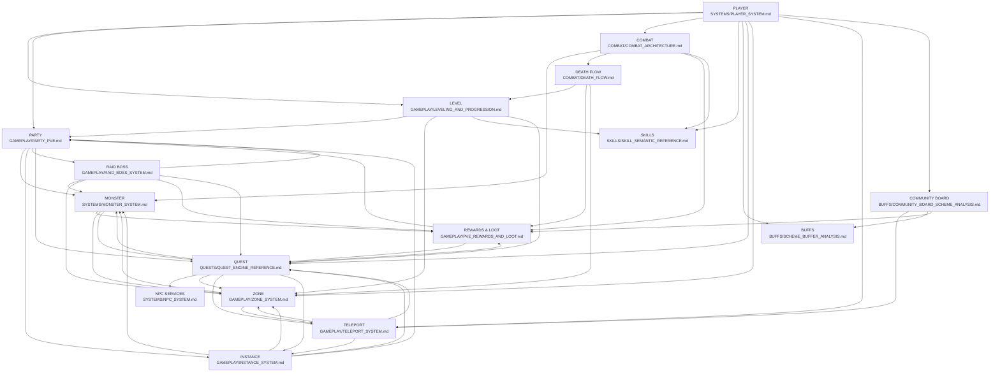

# GAMEPLAY RELATION GRAPH

**Proyecto**: L2J Mobius CT 2.6 HighFive  
**Capa**: GAMEPLAY — Mapa de relaciones entre sistemas PvE  
**Evidence Date**: 2026-08-27 (Sprint 0.7 — Checkpoint 2)  
**Status**: VERIFIED (basado en evidencia SOURCE)

---

## 1. PURPOSE

Este documento modela las relaciones entre todos los sistemas de gameplay PvE del servidor High Five. Cada nodo representa un sistema documentado; cada arista representa una relación verificada en SOURCE.

---

## 2. CENTRAL GRAPH

---

## 3. RELATIONSHIPS (verificadas)

| Desde | Hacia | Naturaleza | Evidencia SOURCE |
|---|---|---|---|
| PLAYER | LEVEL | Progresión | `Player.getLevel()`, `PlayerStat.addExpAndSp()` |
| PLAYER | PARTY | Grupo | `Player.getParty()`, `Party.java` |
| PLAYER | COMBAT | Combate | `Player.doAttack()`, `Player.doCast()` |
| PLAYER | SKILLS | Aprendizaje | `SkillTreeData`, `SkillLearning` |
| PLAYER | QUEST | Estado | `QuestState`, `Quest.getRandomPartyMember()` |
| PLAYER | ZONE | Ubicación | `ZoneManager`, `Player.isInsideZone()` |
| PLAYER | TELEPORT | Movimiento | `Player.teleToLocation()`, `TeleporterData` |
| LEVEL | PARTY | EXP share por nivel | `Attackable.calculateRewards()` usa level diff |
| LEVEL | SKILLS | Skills por nivel | `SkillTree` tiered por level |
| LEVEL | QUEST | MIN_LEVEL checks | `player.getLevel() >= MIN_LEVEL` |
| LEVEL | ZONE | Acceso por nivel | Nivel de mobs en zona |
| PARTY | MONSTER | Ataque grupal | `Attackable._aggroList` multi-jugador |
| PARTY | INSTANCE | Entry | Instance requiere party |
| PARTY | RAID | Entry | Raid requiere party |
| PARTY | QUEST | Party credit | `getRandomPartyMember()` |
| COMBAT | MONSTER | Daño/aggro | `Attackable.addDamage()`, `getMostHated()` |
| COMBAT | DEATH | Muerte | `Creature.doDie()` |
| COMBAT | REWARDS | Drops/EXP | `calculateRewards()`, `doItemDrop()` |
| DEATH | LEVEL | XP loss | `calculateDeathExpPenalty()` |
| DEATH | REWARDS | Item drop | `onDieDropItem()` |
| DEATH | ZONE | Respawn | `ZoneManager.onDeath()` |
| MONSTER | REWARDS | Drops del mob | `NpcTemplate.calculateDrops()` |
| MONSTER | ZONE | Spawn por zona | `SpawnTable`, spawn territory |
| MONSTER | QUEST | Kill targets | `addKillId()`, `onKill()` |
| INSTANCE | MONSTER | Bosses/NPCs | `Instance.spawnGroup()`, `Instance.getNpcs()` |
| INSTANCE | ZONE | BossZone | `BossZone` |
| INSTANCE | PARTY | Entry req | `InstanceWorld.addAllowed()` |
| RAID | MONSTER | Boss | `RaidBoss extends Monster` |
| RAID | ZONE | BossZone | `BossZone` |
| RAID | PARTY | Party req | Raid points distribuidos por party |
| RAID | REWARDS | Drops broadcast | `C1_DIED_AND_DROPPED_S3_S2` |
| ZONE | MONSTER | Territorios | `NpcSpawnTerritory` |
| ZONE | TELEPORT | Acceso | `MapRegion`, Gatekeeper |
| TELEPORT | ZONE | Destino | `TeleportLocation.x/y/z` → zone |
| TELEPORT | INSTANCE | Entry | `DungeonGatekeeper` |
| TELEPORT | QUEST | Travel | `player.teleToLocation()` script |
| QUEST | NPC | Interacción | `onTalk()`, `onEvent()` |
| QUEST | MONSTER | Kills | `addKillId()`, `onKill()` |
| QUEST | REWARDS | Items/EXP/SP | `giveItems()`, `addExpAndSp()` |
| QUEST | ZONE | Ubicación | NPC location, mob spawn zone |
| QUEST | TELEPORT | Script | `teleToLocation()` in quest |